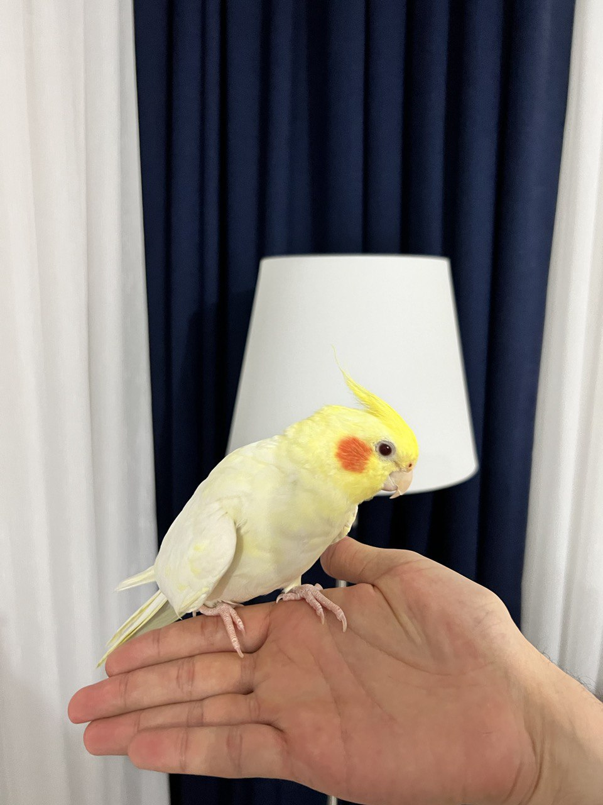

## Bird Information

- **Name:** Kaju
- **Lastname:** Turkoglu
- **Sex:** Male
- **Species:** Cockatiel Parakeet
- **Breed:** Captive
- **Ring Text:** TKF 34P 147 250 21X  
- **Country of Origin:** Australia
- **Birth Date:** 19/01/2021
- **Birth Place:** Istanbul
- **Breeder:** [Akkus Farm Production](http://www.akkusuretim.com){:target="_blank"}
- **Health Issues:** None
- **Favorite Foods:** Apples, Cooked(boiled) Peas, Cucumbers, Carrots

## Spoken Words & Mimics

1. Kaju
2. Kaju Habibi
3. Peekapoo (When you cover his head)
4. Naber (Meaning "How are you" in Turkish)
5. BES! (When Angry, meaning "Enough" in Arabic)
6. Baby Shark (mimic)

## Owner Info

- **Name:** Besir
- **Lastname:**  Turkoglu
- **Email:** [besirturkoglu+kaju@hotmail.com](mailto:besirturkoglu+kaju@hotmail.com)
- **Address:** Bostanci, Kadikoy, Istanbul/Turkey
- [Twitter](https://twitter.com/engi2nee){:target="_blank"}, [Telegram](https://t.me/engi2nee){:target="_blank"} 
